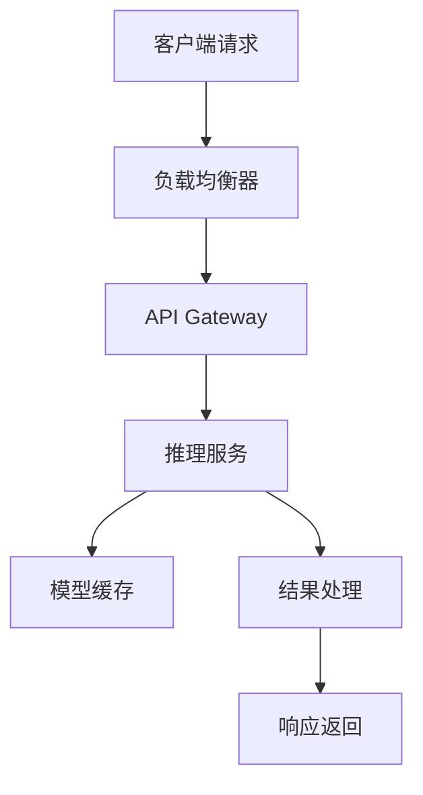

# Real-Time Inference System 概述

## 系统简介

Real-Time Inference System 是 StreamMUSE 的核心推理引擎，专为高并发、低延迟的实时数据处理场景设计。

## 主要特性

- **高性能**: 支持毫秒级响应时间
- **高可用**: 99.9% 服务可用性保证
- **弹性扩展**: 支持动态扩缩容
- **多模型支持**: 支持多种深度学习框架

## 系统架构

## 核心组件

### 推理引擎
- 模型加载与管理
- 批处理优化
- 内存管理

### 缓存系统
- 模型缓存
- 结果缓存
- 预热机制

### 监控系统
- 性能监控
- 资源监控
- 错误追踪

## 快速开始

请查看 [快速开始指南](quickstart.md) 了解如何部署和使用系统。
